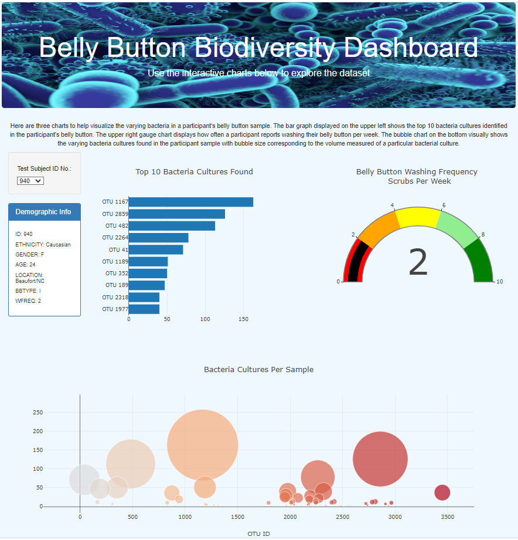

## Belly Button Bacterial Diversity

### Overview

Our friend, Roza, works for a company investigating whether bacteria species living in human belly buttons may be candidates for supporting the manufacture of synthetic beef. Roza facilitated a research endeavor to obtain belly button samples from human participants. 
We helped Roza develop an online dashboard to display data about individual participant belly button data.

### Results and Summary
The resulting product is a dashboard with a dropdown menu to select a participant by their deidentified research ID. Selecting this ID reveals a number of interesting details on the dashboard including participant demographics and three charts: 1) top 10 bacteria cultures found in the participant's belly button, 2) gauge displaying how frequently they wash their belly button, 3) the volume of particular bacterials cultures per participant sample via bubble chart. 

Explore the data for yourself! https://skyesteptoe.github.io/bellybutton/

